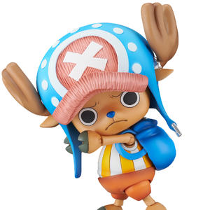
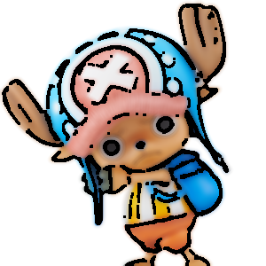
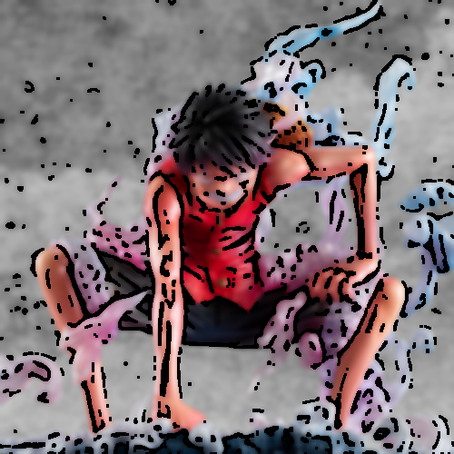

# Cartoon Rendering (만화 스타일 변환)

## 개요
OpenCV 이미지 처리 기법을 활용하여 일반 사진을 만화(cartoon) 스타일로 변환하는 프로그램입니다.

## 사용 기법

| 단계 | 기법 | 역할 |
|------|------|------|
| 1 | Bilateral Filter | 엣지를 보존하면서 색상 평탄화 |
| 2 | Median Blur | 노이즈 제거 |
| 3 | Adaptive Thresholding | 윤곽선(엣지) 마스크 생성 |
| 4 | Morphological Closing | 엣지 끊김 정리 |
| 5 | bitwise_and | 윤곽선 + 색상 이미지 합성 |

## 알고리즘 파이프라인
```
원본 이미지
  ├─ [1] Bilateral Filter        → 색상 평탄화
  ├─ [2] Grayscale + Median Blur → 노이즈 제거
  ├─ [3] Adaptive Thresholding   → 윤곽선 마스크
  ├─ [4] Morphological Closing   → 엣지 정리
  └─ [5] bitwise_and 합성        → 만화 결과
```

## 사용법
```bash
python Cartoon_Rendering_KHJ.py [이미지 경로]
```
- 인자를 생략하면 `input.jpg`를 기본 입력으로 사용
- 결과는 `Saved/` 폴더에 `{원본이름}_cartoon.png`으로 저장

---

## 데모

### 잘 표현되는 이미지
**특징:** 윤곽이 뚜렷하고 배경이 단순한 이미지

| 원본 | 만화 변환 |
|------|-----------|
|  |  |

- 건물, 간판 등 **색상 경계가 명확한** 이미지에서 만화 느낌이 잘 나옴
- 평면적인 영역이 넓을수록 효과적

### 잘 표현되지 않는 이미지
**특징:** 세밀한 텍스처가 많은 이미지

| 원본 | 만화 변환 |
|------|-----------|
|  |  |


- 풀밭, 머리카락, 나뭇잎 등 **반복 텍스처** 영역에서 엣지가 과도하게 검출됨
- 그라데이션이 많은 하늘/일몰 사진에서 부자연스러운 경계 발생

---

## 한계점

### 1. 고정 파라미터
- `blockSize=9`, `C=5` 등이 모든 이미지에 동일하게 적용되어, 어두운/밝은 이미지에서 엣지 품질이 달라짐

### 2. 텍스처 처리 한계
- Adaptive Threshold는 풀밭, 머리카락 같은 세밀한 텍스처에서 과도한 엣지를 생성하여 노이즈처럼 보임

### 3. 색상 단순화 부족
- Bilateral Filter 1회만 적용하므로 색상이 충분히 평탄화되지 않아, 사실적인 느낌이 남아있을 수 있음

### 4. 처리 속도
- Bilateral Filter는 계산량이 많아 고해상도 이미지에서 느려질 수 있음

### 5. 의미론적 이해 부재
- 픽셀 단위 처리만 수행하므로 얼굴/배경 등 객체를 구분하지 못하고, 모든 영역에 동일한 필터가 적용됨
